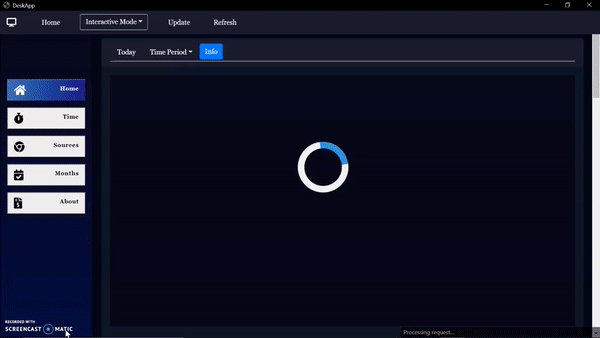

<h1> <strong>  DeskApp</strong></h1>

&nbsp;
&nbsp;

### Website Link - [Click here ](https://getdeskapp.herokuapp.com/) [Get DeskApp](https://getdeskapp.herokuapp.com/)

 

### [Watch a complete preview on Linkdin](https://www.linkedin.com/posts/sudhanshu-pandey-847448193_artificialintelliegence-nlp-desktops-activity-6795211619392598017-eXb8) 

 

# Description

This is a Desktop Application for users who spend a lot of time on there PC/Laptop. 
Using Artificial Intelligence and Analytics , this software aims to help user in introspecting there action/activity for a long period of time.

 

# Inspired from
Tech gaints like Facebook, Instagram, Twitter and other big companies, by looking your data gathered from various sources knows "hidden attributes about you that you didn’t even know you were sharing information about"
 

So the main idea about the project is to use our own data to study our own beheviour and optimize our work efficiency by using the power of latest AI Algorithm and Analytices which helps us in

1. Understing our <strong>Micro habites</strong>
2. Working pattern
3. Our biases

 

 

# Preview

<a href="https://getdeskapp.herokuapp.com/">

